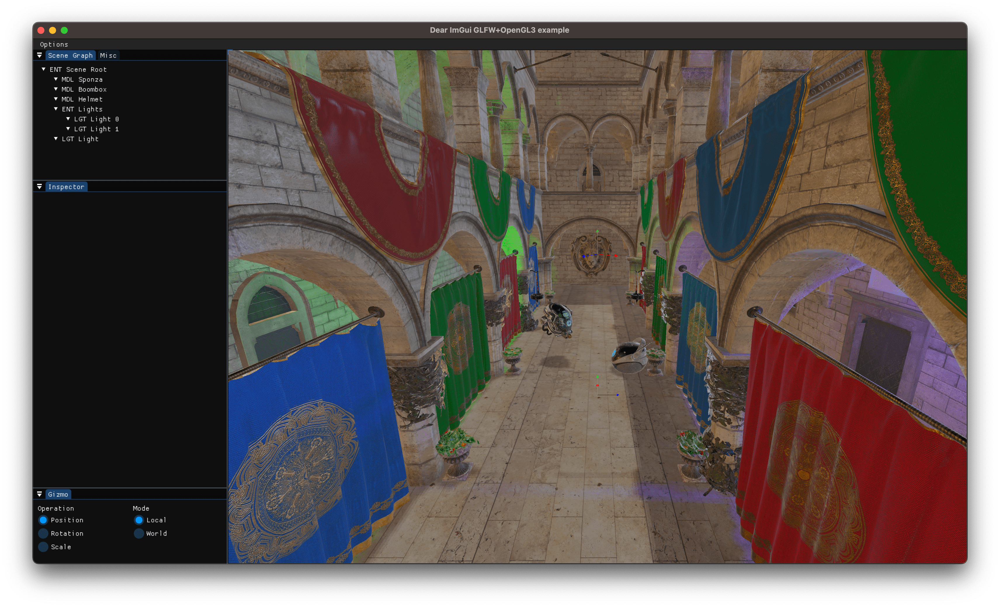
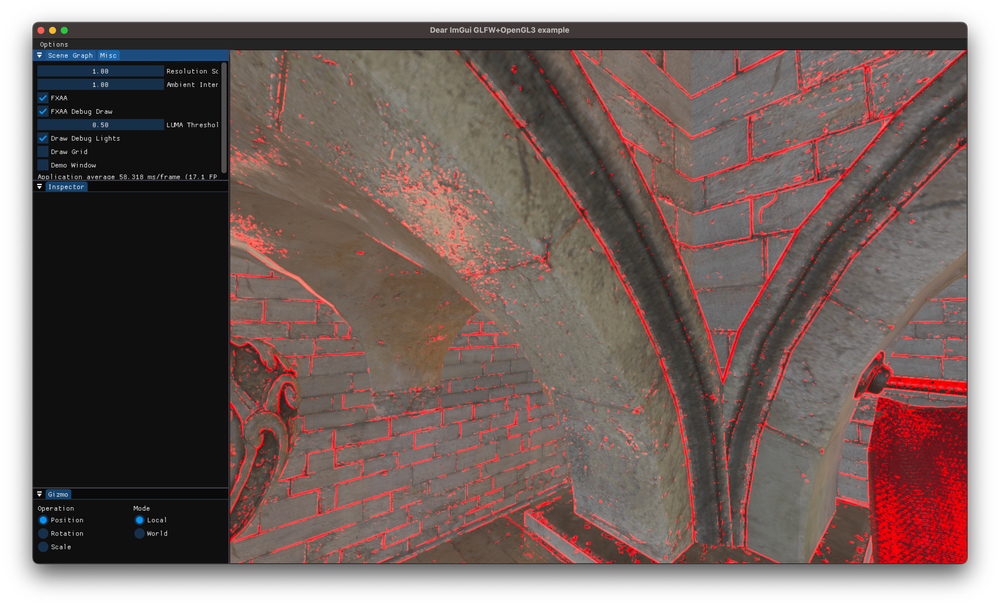
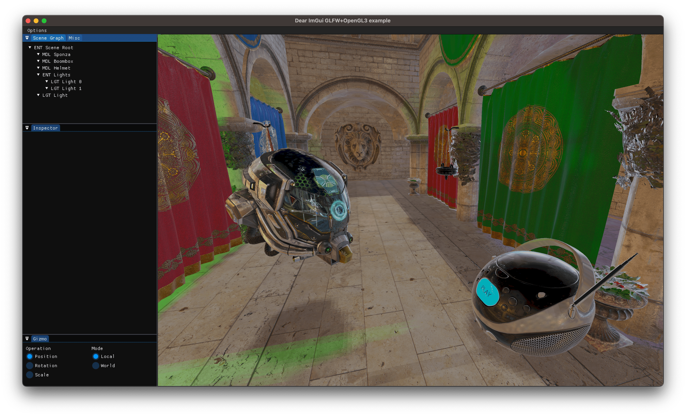
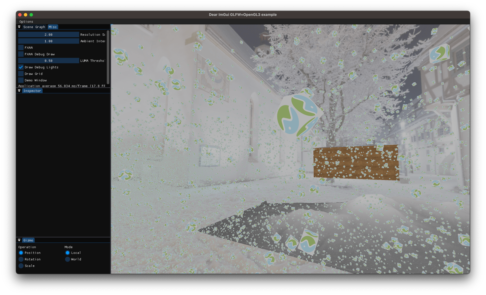

[](../../actions)

# OpenGLGP

## Features

- [x] PBR
- [x] Environment Mapping
- [x] IBL
- [x] Lights & tools for controlling them
- [x] Gizmos
- [x] Shadow mapping
- [x] Scene Graph
- [x] Instanced Rendering
- [x] Postprocessing - Gamma Correction & FXAA
- [x] Geometry Shader

## Setup

In order to build the project you first need to create CMake build directory.

```bash
cmake -B build
```

After that compile the project using whatever generator you used.

For example: for Visual Studio it means opening the generated .sln file. For compiling with Ninja, you need to run `ninja -C build`.

## Running the project

When running the project make sure that your current working directory is the root of this repository.

## Controls

Right click on viewport in order to control camera.

While controling the camera, use `WASD` to navigate and `Control` / `Space` to move camera down / up.

When model is selected you can switch gizmos with `W`, `E` and `R` keys.

## Screenshots

### Default view

Sponza scene lit by 1 directional light from the top (sun) and 2 point lights (green and blue) orbiting around the center.



### Postprocessing - FXAA

Debug View of FXAA edge detection. Edge detection threshold can be changed by tweaking the `LUMA Threshold` slider in the `Misc` tab.



### Models Closeup

The whole scene is rendered using PBR. You can see reflections of the skymap on the helmet and boombox.



### Instanced Rendering

1 million textured cubes are rendered around the scene.



### Geometry Shader

Triangles are being created from the heightmap terrain. Then they are being moved along their normals.


